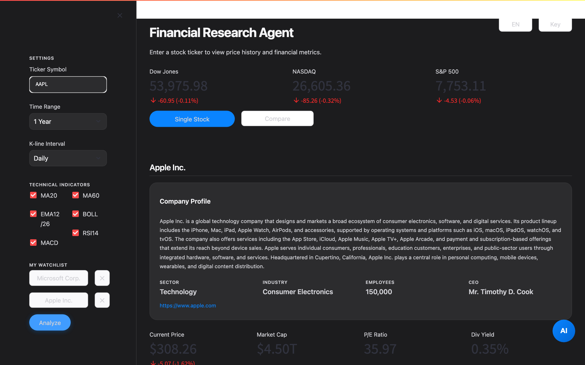
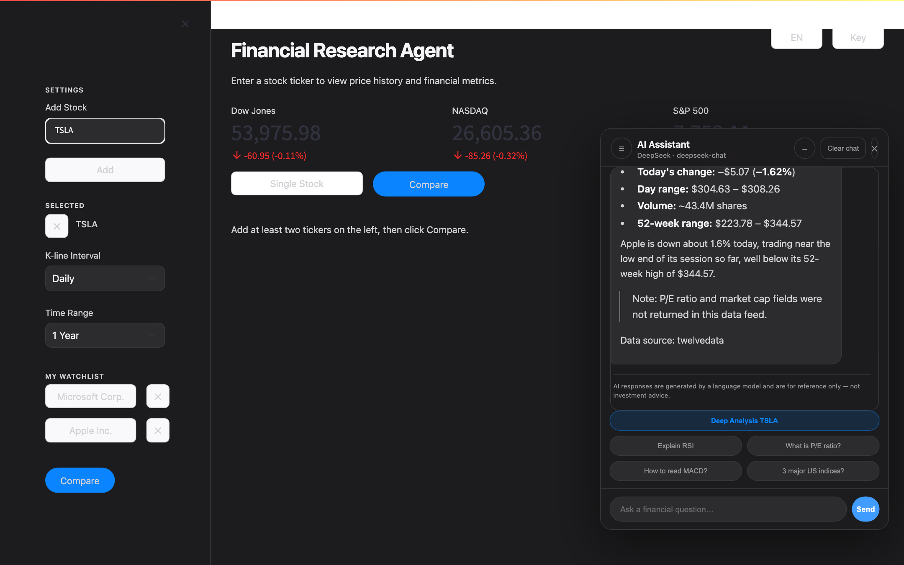
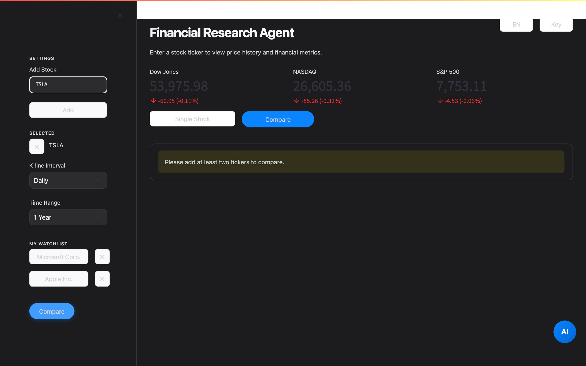
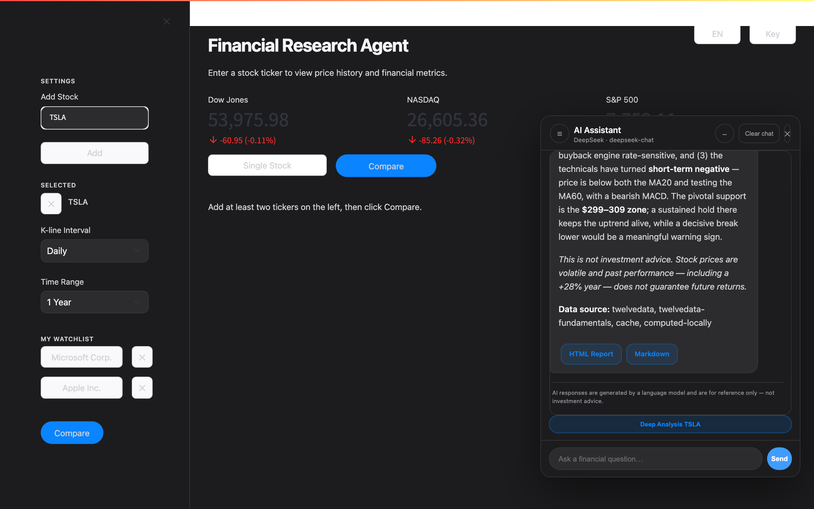

# 📊 Evidence-Based Financial Research Agent

**[English](README.en.md) | 中文**

[](https://github.com/TianhaoLi1105/evidence-based-financial-research-agent/actions/workflows/tests.yml)

**一个基于真实数据的金融研究助手** —— 输入股票代码，获取行情、财务、新闻与 AI 深度研报。

基于 [Streamlit](https://streamlit.io) 构建，全部数据来自**免费数据源**（多源自动降级），内置可对话的 **AI Agent**（支持 DeepSeek / 通义千问 / 智谱 GLM / OpenAI / Ollama），生成带数据来源标注与风险复核的专业研报。

> ⚠️ 本项目仅供学习与研究，不构成任何投资建议。

---

## ✨ 功能亮点

### 📈 行情分析（V1–V2）
- 任意美股 K 线图（日 / 周 / 月），支持时间范围切换
- 技术指标：MA20 / MA60 / EMA12/26 / MACD / BOLL / RSI14
- 公司概况：简介、行业、板块、CEO、员工数、官网（免费源兜底）
- 财务数据：营收、净利、毛利率、负债率、现金流、EPS、ROE 等（四源降级）
- 多股对比：归一化走势图 + 估值/财务指标对比表 + 自选股
- 市场概览（三大指数）与 K 线 CSV 下载

### 🤖 AI 智能 Agent（V3）
- 右下角悬浮对话窗，流式输出，支持多话题会话（本地持久化）
- **9 个数据工具**：实时报价、历史 K 线、财务深度、公司概况、技术指标、多股对比、估值判断、新闻情绪、对话内出图
- **深度分析研报**：自动调用完整工具链，输出 6 章节结构化报告（公司概况 / 财务与估值 / 技术面 / 主要风险 / **数据自检** / 结论），可下载 HTML / Markdown
- **数据来源逐条标注**：每个关键数字标注来源，拒绝编造
- **分析师 → 风控二次审阅**（可选开关）：独立风控角色复核数据支撑、指出缺口与遗漏风险
- **估值贵贱判断**：问「AAPL 现在贵不贵」→ 对比行业同行中位数 + 52 周价格位置
- **新闻与情绪**：抓取公司新闻并对标题做情绪打分
- 对话内直接出图（K 线 / 折线 / 多股对比）
- 个性化记忆：记住常看股票与关注话题，注入对话上下文

### 🌍 体验
- 中英双语一键切换（语言记忆）
- Apple 风格深色 UI，无第三方追踪
- 多模型自由切换：DeepSeek / Qwen / GLM / OpenAI / Ollama / 自定义端点

---

## 📸 功能截图

截图位于 `docs/screenshots/`（首次运行可执行下方脚本一键生成）：

```bash
python scripts/capture_screenshots.py   # 需要先安装 playwright
```

| 单股分析 | AI 对话与深度研报 |
| --- | --- |
|  |  |

| 多股对比 | 深度研报（下载） |
| --- | --- |
|  |  |

---

## 🚀 快速开始

### 1. 环境要求
- Python **3.9+**
- 一个 LLM API Key（可选，不配置也能用行情分析；配置后解锁 AI Agent）

### 2. 安装依赖

```bash
git clone https://github.com/TianhaoLi1105/evidence-based-financial-research-agent.git
cd evidence-based-financial-research-agent
pip install -r requirements.txt
```

### 3. 运行

```bash
streamlit run app.py
```

浏览器打开 `http://localhost:8501`。

默认情况下，API Key、模型配置和聊天记录仅保存在当前浏览器会话对应的服务器内存中；刷新页面或重启应用后需重新配置。这使不同访问者不会共用密钥和聊天记录。仅在可信的单人本机环境中，如需恢复原有磁盘持久化，可运行 `AGENT_LOCAL_PERSISTENCE=1 streamlit run app.py`。该模式不适合多人访问。

### 4. 配置
- **数据 API（可选）**：点击右上角 `KEY` → 填写 [Twelve Data](https://twelvedata.com) 免费 Key。不填时自动使用免费备用源（腾讯财经 / stockanalysis.com / 东财），数据略少但功能可用。
- **AI 模型（可选）**：点击右上角 `KEY` → `AI 模型` 标签页 → 选择服务商并填入 API Key。支持：

| 服务商 | Base URL | 默认模型 |
| --- | --- | --- |
| DeepSeek | `https://api.deepseek.com/v1` | `deepseek-chat` |
| 通义千问 (Qwen) | `https://dashscope.aliyuncs.com/compatible-mode/v1` | `qwen-plus` |
| 智谱 GLM | `https://open.bigmodel.cn/api/paas/v4` | `glm-4-flash` |
| OpenAI | `https://api.openai.com/v1` | `gpt-4o-mini` |
| Ollama（本地） | `http://localhost:11434/v1` | `qwen2.5` |
| 自定义 | 任意 OpenAI 兼容端点 | — |

### 5. Docker

已安装 Docker Desktop 的情况下，一条命令完成构建并启动：

```bash
docker compose up --build
```

浏览器打开 `http://localhost:8501`；停止服务使用 `docker compose down`。

---

## 🏗 架构

```
app.py                    # Streamlit 入口：单股分析 / 多股对比 / 市场概览
├── agent/                # AI Agent 层
│   ├── tools.py          #   9 个数据工具（Function Calling）
│   ├── executor.py       #   工具调用循环 + 风控复核
│   ├── prompts.py        #   系统提示词（13 条规则 + 风控角色）
│   └── llm_client.py     #   多提供商 OpenAI 兼容客户端
├── data/                 # 数据层（全部免费源 + 24h 缓存）
│   ├── fundamentals.py   #   四源降级财务深度
│   ├── news.py           #   东财 → Google News
│   ├── valuation.py      #   估值相对位置（同行对比）
│   ├── chat_store.py     #   多话题会话持久化
│   └── preferences.py    #   个性化记忆
├── services/             # 行情/报价降级链路
├── components/           # 页面组件（K线/对比/卡片/AI 聊天窗）
└── i18n.py               # 中英双语（215 键）
```

**数据源降级链（免费优先）**

| 能力 | 降级链 |
| --- | --- |
| 实时报价 | Twelve Data → 腾讯财经 |
| 财务深度 | Twelve Data → stockanalysis.com → yfinance → 新浪 |
| 公司概况 | Twelve Data → stockanalysis.com |
| 新闻 | 东方财富 → Google News |
| 估值对比 | 腾讯/stockanalysis + 本地计算（同行映射 + 52 周分位） |

所有结果带 `source` 字段标注来源；失败静默降级，字段缺失显示 N/A，**绝不编造**。

---

## ✅ 测试

项目维护 18 组回归测试（覆盖工具层、降级链路、AI 事件流、渲染、记忆和 Evaluation，全部 **mock 数据源、无需网络**）：

```bash
bash tests/run_all.sh        # 一键运行全部 18 组
python tests/test_v343.py    # 运行单组（如估值）
```

| 测试文件 | 覆盖范围 |
| --- | --- |
| `tests/test_v31_*.py` | LLM 客户端、消息组装、i18n、应用流程 |
| `tests/test_v32_*.py` | 工具层、深度分析、图表、出图兜底 |
| `tests/test_v33_*.py` | 上下文增强、出图持久化、个性化记忆 |
| `tests/test_v341.py` ~ `test_v345.py` | 财务深度、新闻情绪、估值、报告/风控、收尾增强 |
| `tests/test_lang_mem.py` / `test_chat_store.py` | 语言记忆、多话题存储 |
| `tests/test_security_provenance.py` / `test_evaluation.py` | 会话隔离、来源追踪、评测数据与指标 |

### 真实 Agent Evaluation

`evals/tool_routing_cases.jsonl` 包含 54 条中英文问题，9 个工具各 6 条，每条均标注 `expected_tools`。使用本地已配置的模型和真实数据工具运行：

**评测规则：** DeepSeek Chat 回答 54 条双语问题，覆盖 9 个工具；Tool routing accuracy 使用严格 exact-match，实际工具集合必须与 `expected_tools` 完全相同，任何额外工具调用也计为 routing failure。

```bash
AGENT_LOCAL_PERSISTENCE=1 python3 scripts/evaluate_agent.py
```

最新真实运行结果见 [`docs/EVALUATION.md`](docs/EVALUATION.md)，完整逐题结果保存在 `evals/results/latest.json`。

GitHub Actions 每次 push 和 pull request 自动运行 18 组离线回归测试并构建 Docker 镜像。真实 Evaluation 不在 CI 中运行，因为它会调用真实 LLM/API、产生费用，结果也可能存在随机性。


---

## 🔒 隐私与安全

- **默认会话隔离**：API Key、模型配置和聊天历史只保存在当前 Streamlit 会话的服务器内存中，不同访问者互不可见
- **单人本机持久化可选**：设置 `AGENT_LOCAL_PERSISTENCE=1` 后使用 `.agent_config.json` 和 `chat_history.json`（均已被 `.gitignore` 排除）
- **无第三方追踪**：应用不收集、不上传任何用户数据
- **数据源均为公开免费接口**：不涉及用户隐私信息
- **密钥永不出现在日志或代码中**

---

## 📄 免责声明

本项目仅供**学习与研究**目的。所有数据来自公开免费接口，可能延迟或不完整；AI 生成内容仅供参考，**不构成任何投资建议**。股市有风险，投资需谨慎。

---

## 🗺 Roadmap

- [x] V1 基础行情网站
- [x] V2 多股对比 + 公司概况 + CSV 导出
- [x] V3 AI Agent（工具层 / 多话题 / 出图 / 财务深度 / 新闻情绪 / 估值 / 风险复核）
- [ ] V4：更多数据源（备用 API）、多股票对比问答、PDF 研报导出

---

## 📄 License

[MIT](LICENSE) © 2026 Evidence-Based Financial Research Agent contributors
